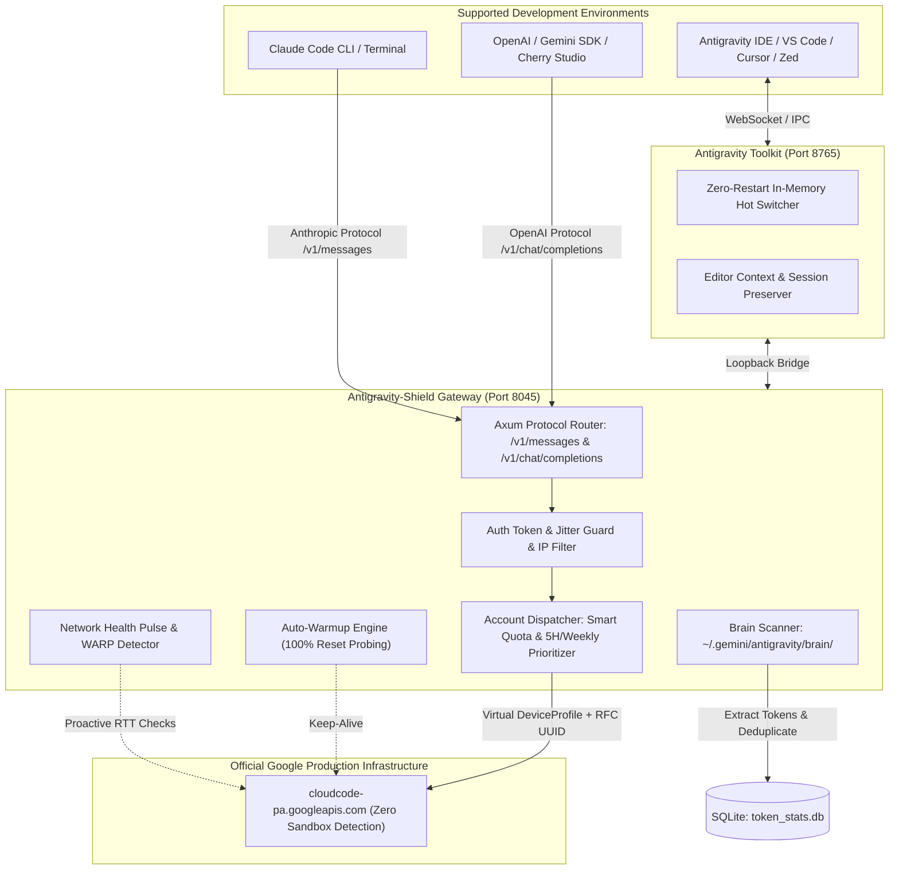

# Antigravity-Shield 🛡️
> The Hardened, Zero-Restart AI Account Manager & Multi-IDE Protocol Gateway (v5.10.1)

<div align="center">
  

  <h3>Your Dedicated High-Performance, Anti-Ban AI Gateway & Developer Hub</h3>
  <p>Engineered for seamless multi-account AI routing, zero-restart IDE account switching, local chat telemetry, and rock-solid account safety.</p>
  
  <p>
    <a href="https://github.com/doctorguidance/antigravity-shield/releases"></a>
    
    
    
    
    
    
    
    
  </p>

  <p>
    <a href="#-whats-new-in-v510-killer-features">⚡ What's New</a> • 
    <a href="#-why-antigravity-shield-the-anti-403-solution">Why Shield? (Anti-403)</a> • 
    <a href="#-interface-showcase">Showcase</a> • 
    <a href="#-key-features">Key Features</a> • 
    <a href="#-quick-integration">Quick Integration</a> • 
    <a href="#-architecture">Architecture</a> • 
    <a href="#-installation">Installation</a> • 
    <a href="#-license--attribution">License</a>
  </p>

  <p>
    <strong>English</strong> | 
    <a href="./README_ZH.md">简体中文</a>
  </p>
</div>

---

## ⚡ What's New in v5.10 (Killer Features)

| Feature | Description | Highlight |
| :--- | :--- | :--- |
| 🔌 **Zero-Restart IDE Hot-Switching** | Bundled **Antigravity Toolkit 2.2.0** extension enables 1-click account switching inside **Antigravity IDE, VS Code, JetBrains, Zed, and Xcode** without closing or reopening IDE windows. | Keeps running agent sessions, terminal state, and unsaved file buffers 100% intact via local loopback bridge (`127.0.0.1:8765`). |
| 🧠 **Autonomous Brain & Chat History Scanner** | Native Rust `brain_scanner` engine watches local transcript logs (`~/.gemini/antigravity/brain/`) in real-time every 3 seconds, recovering token usage and multi-turn chat statistics. | Automatically parses prompt/completion tokens, model identities, and conversation trees into local SQLite analytics. |
| 💓 **Live Network Health Pulse & Region Radar** | Real-time connection pulse testing upstream latency to **Google Production APIs**, **Gemini Endpoints**, and **Global Internet**. | Built-in Cloudflare WARP detector and in-app step-by-step unblocking guide for geoblocked regions (HTTP 400 location errors). |
| 📊 **53-Week Annual Token Heatmap** | Interactive GitHub-style contribution calendar mapping token burn across the entire year with 5 dynamic intensity levels. | Filter usage across **Antigravity IDE**, **Antigravity CLI (`agy`)**, and the **Gateway Proxy** with single-day click-to-inspect drilldowns. |
| 🇮🇷 **Native Persian / RTL & Vazirmatn Font Engine** | Non-destructive 1-click styling injection for Antigravity IDE and Desktop UI with beautiful Vazirmatn typography. | Enforces `unicode-bidi: plaintext` with preserved left-to-right syntax-highlighted code blocks. |
| 🔄 **Resilient Direct Streaming In-App Auto-Updater** | Native streaming download engine with real-time percentage progress bars, Minisign signature verification, and detached installer handoff. | Eliminates stalled updates and manual browser downloads completely. |
| 🪟 **Always-On-Top MiniView & Frameless Desktop HUD** | Floating ultra-compact HUD (down to 110x52) with live quota gauges, active account switcher, and native Windows caption controls. | Monitor model quotas and switch accounts without obscuring code editors. |
| 🔥 **Smart Auto-Warmup on 100% Quota Reset** | Autonomous background keep-alive probes that pre-warm recovered accounts as soon as 5-hour or weekly quota resets complete. | Completely eliminates first-request cold-start latency when quota buckets recover. |

---

## 🛡️ Why Antigravity-Shield? (The Anti-403 Solution)

While the original upstream project (`lbjlaq/Antigravity-Manager`) provided a basic proxy framework, over **1,800+ community issues** accumulated due to critical architectural vulnerabilities when running high-concurrency AI coding agents (**Claude Code CLI, Cursor, OpenCode, OpenClaw**).

**Antigravity-Shield** is an independently maintained, deeply hardened distribution that systematically resolves these root causes across the proxy, account rotation, and network layers.

### 📊 Reliability & Architecture Comparison

| Architectural Dimension | Upstream Distribution | 🛡️ Antigravity-Shield Enterprise Hardened |
| :--- | :--- | :--- |
| **Upstream Routing & API Safety** | ❌ Requests route through unverified endpoints, leading to unexpected security suspensions. | ✅ **Strict Production Egress:** Enforces verified production endpoints with strict request integrity and zero unverified routing. |
| **Identity & Account Isolation** | ❌ Single shared physical host footprint across all accounts, triggering rapid correlation and cluster flags. | ✅ **Virtual Device Profile Isolation:** Deterministic, isolated per-account hardware profiles preventing cross-account identity correlation. |
| **Fault Isolation & Account Protection** | ❌ Domino-effect account burns where a single challenge cascades across the entire rotation pool. | ✅ **Multi-Tier Fault Isolation:** Intelligent quarantine and isolated cooldown buffers protect healthy accounts from cascading rate-limit or challenge strikes. |
| **High-Concurrency Architecture** | ❌ Synchronous thread serialization and blocking disk I/O, causing high-frequency deadlocks and timeout drops. | ✅ **Non-Blocking Asynchronous Engine:** Fully asynchronous pipeline with decoupled state caching and fine-grained locking under heavy multi-agent loads. |
| **Context Window Preservation** | ❌ Session drift and uncontrolled token compounding inflating context windows to quota-exhausting ceilings. | ✅ **Context Stream Reconciliation:** Intelligent turn normalization and historical reasoning optimization, keeping token consumption lean and predictable. |
| **Agent Tool Protocol Reliability** | ❌ Agent execution aborts when downstream models output raw tool invocations in unstructured streams. | ✅ **Fault-Tolerant Protocol Translation:** Robust bi-directional protocol adaptation ensuring continuous, unbroken multi-step tool execution. |
| **Regional Network Resilience** | ❌ Strict transport drops on region-specific upstream responses with zero retry capabilities. | ✅ **Adaptive Routing & Failover:** Automated transport-level retry strategies and resilient proxy failover maintaining active agent sessions. |
| **IDE Account Switching** | ❌ Requires terminating and reopening IDE processes, destroying active agent loops, terminals, and buffers. | ✅ **Zero-Restart Live Toolkit Bridge:** Seamless in-memory account switching inside running IDEs with full session continuity. |
| **Continuous Automated Verification** | ❌ Manual verification with high risk of protocol regressions and unexpected behavior under load. | ✅ **Comprehensive Automated Verification:** 100% automated end-to-end regression validation guaranteeing system-wide protocol fidelity. |

---

## 📸 Interface Showcase

| 💓 System & AI Health Pulse Radar | 🎛️ Multi-Account Quota Grid & Reset Windows |
| :---: | :---: |
| <a href="docs/images/dashboard-overview.png"></a> | <a href="docs/images/accounts-quota-grid.png"></a> |
| <sub>Real-time upstream probe, proxy status & pool summary</sub> | <sub>Side-by-side Gemini 3.1 Pro, 3.8 Flash & Claude 5H/weekly resets</sub> |

| 📊 53-Week Token Activity Heatmap | 🇮🇷 Native RTL & Vazirmatn Font Patch |
| :---: | :---: |
| <a href="docs/images/token-stats-heatmap.png"></a> | <a href="docs/images/vazirmatn-rtl-patch.png"></a> |
| <sub>Annual activity calendar & multi-IDE token burn telemetry</sub> | <sub>1-Click non-destructive Persian / Arabic typography patch for Antigravity & IDE</sub> |

---

## 🌟 Key Features

### 1. 🔌 Antigravity Toolkit & Zero-Restart Account Hot-Switching
* **No IDE Restarts Required:** Connects to Antigravity IDE, VS Code, Cursor, Zed, and Xcode via local loopback bridge (`127.0.0.1:8765`). Switch accounts on-the-fly without killing editors, dropping active Claude Code agent loops, or losing unsaved editor buffers.
* **1-Click Extension Installation:** Bundled `antigravity-toolkit.vsix` installs directly with one click from the UI.
* **Bi-Directional Telemetry:** Live heartbeat badge in the header shows active editor connection, active account email, and port fallback status.

### 2. 🧠 Conversation Telemetry & Brain Scanner
* **Autonomous File Watcher:** Rust-powered watcher monitors `~/.gemini/antigravity/brain/` every 3 seconds for newly written prompt/response transcripts.
* **Full Context Extraction:** Reconstructs token consumption, model IDs, conversation branches, and error rates.
* **Multi-Source Attribution:** Cleanly differentiates usage across **Antigravity IDE**, **Antigravity CLI (`agy`)**, and the **Local Gateway Proxy (`port 8045`)**.

### 3. 💓 Network Health Pulse & Geoblock Radar
* **Live Latency Probes:** Proactively measures Round-Trip Time (RTT) to official Google production endpoints (`cloudcode-pa.googleapis.com`), Gemini SDK APIs, and general Internet access.
* **WARP & Geo-Restriction Guide:** Detects regional blocks (HTTP 400 "User location not supported") and opens an interactive, illustrated unblocking guide.

### 4. 🎛️ Intelligent Multi-Account Quota Routing
* **Rolling 5-Hour & Weekly Reset Windows:** Side-by-side countdown steppers track exact recovery times for Gemini 3.1 Pro, Gemini 3 Flash, Claude 3.7 Sonnet, and Imagen 3.
* **Smart Auto-Sort & Failover:** Automatically routes traffic to accounts with the highest remaining quota score and shifts traffic away from rate-limited (HTTP 429) accounts.
* **Smart Auto-Warmup:** Proactively warms accounts as soon as their quota resets to 100%, eliminating cold-start latency.

### 5. 🔌 Universal Protocol Translation (API Gateway)
* **OpenAI Compatible:** Standard `/v1/chat/completions` endpoint for plug-and-play compatibility with Cursor, Cherry Studio, NextChat, OpenCode, and Windsurf.
* **Anthropic Messages Protocol:** Native `/v1/messages` endpoint with full reasoning/thinking chain support, custom system prompts, and full compatibility with **Claude Code CLI**.
* **Google Gemini Protocol:** Direct support for native Gemini SDK clients.

### 6. 🇮🇷 Native Persian / RTL & Vazirmatn Typography
* **1-Click IDE & Desktop Patch:** Injects Persian RTL support and the modern Vazirmatn typeface with a single toggle.
* **Non-Destructive:** Automatically creates `.bak` backups and enforces clean left-to-right alignment for code blocks and monospace tokens.

### 7. 🎨 High-Definition Image Generation (Imagen 3)
* Support for arbitrary aspect ratios (1:1, 16:9, 9:16, 4:3, 21:9) and resolutions up to 4K via standard OpenAI image parameters or chat prompts.

---

## 🔌 Quick Integration

### 1. Claude Code CLI
Start the API proxy in Antigravity-Shield (default port: `8045`), then run in your terminal:

```bash
export ANTHROPIC_API_KEY="sk-antigravity"
export ANTHROPIC_BASE_URL="http://127.0.0.1:8045"
claude
```

On Windows PowerShell:
```powershell
$env:ANTHROPIC_API_KEY = "sk-antigravity"
$env:ANTHROPIC_BASE_URL = "http://127.0.0.1:8045"
claude
```

### 2. Cursor / Windsurf / Cherry Studio / NextChat (OpenAI Protocol)
* **Base URL:** `http://127.0.0.1:8045/v1`
* **API Key:** `sk-antigravity` (or your configured custom key in Settings)
* **Models:** `gemini-3-pro-high`, `gemini-3-flash`, `claude-sonnet-4-6`

### 3. Python SDK Example
```python
import openai

client = openai.OpenAI(
    api_key="sk-antigravity",
    base_url="http://127.0.0.1:8045/v1"
)

response = client.chat.completions.create(
    model="gemini-3-flash",
    messages=[{"role": "user", "content": "Explain quantum computing in 3 sentences."}]
)
print(response.choices[0].message.content)
```

---

## 🏗️ Architecture



---

## 📦 Installation

### Pre-built Binaries (Recommended)
Download the latest verified binaries directly from [GitHub Releases](https://github.com/doctorguidance/antigravity-shield/releases/latest):
* **Windows:** `Antigravity.Shield_5.10.1_x64-setup.exe` (or standalone portable package)
* **macOS:** `.dmg` (Apple Silicon & Intel)
* **Linux:** `.deb` or `.AppImage`

> [!TIP]
> **Seamless In-App Updates**: Once installed, future updates are delivered through the built-in streaming updater with real-time download progress and zero manual downloads.

### Running via Docker (Headless Server)
```bash
docker run -d --name antigravity-shield \
  -p 8045:8045 \
  -e API_KEY=sk-your-api-key \
  -e WEB_PASSWORD=your-admin-password \
  -v ~/.antigravity_shield:/root/.antigravity_shield \
  doctorguidance/antigravity-shield:latest
```

---

## ⚖️ License & Attribution

* **License:** Distributed under the **Creative Commons Attribution-NonCommercial-ShareAlike 4.0 International License (CC BY-NC-SA 4.0)**. Strictly for personal, non-commercial use.
* **Upstream Attribution:** Antigravity-Shield is an independently maintained, hardened distribution based on the open-source project [lbjlaq/Antigravity-Manager](https://github.com/lbjlaq/Antigravity-Manager) created by [lbjlaq](https://github.com/lbjlaq) and its contributors. All upstream copyrights, git history, and contributor credits are respectfully preserved.
* **Privacy Guarantee:** All OAuth tokens and credentials remain 100% locally encrypted on your machine in a local SQLite database. Zero telemetry or credentials ever leave your local computer.

---

<div align="center">
  <p>Engineered with ❤️ for account safety, zero downtime, and high-performance AI coding workflows.</p>
  <p>Copyright © 2024–2026 Antigravity-Shield Contributors.</p>
</div>
