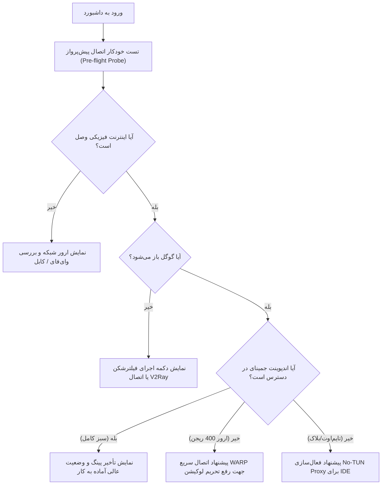

# 💡 سند جامع طوفان فکری و معماری محصول: پالس وضعیت اینترنت و هوش مصنوعی جمینای (Gemini & Network Health Pulse)
**پروژه:** Antigravity-Shield  
**تاریخ:** سپتامبر ۲۰۲۶  
**چارچوب:** Product Trio Discovery (مدیر محصول، طراح تجربه کاربری، مهندس نرم‌افزار) — بر مبنای متدولوژی Teresa Torres  

---

## ۱. درک فرصت و صورت مسأله (Opportunity Understanding)

- **محصول:** نرم‌افزار دسکتاپ Antigravity-Shield (مبتنی بر Tauri v2 + Rust + React 19 + TypeScript + Tailwind CSS).
- **جامعه مخاطب هدف:** برنامه‌نویسان و کاربران در محیط‌های اینترنتی با محدودیت‌های شدید (مانند ایران و مناطق تحریم‌شده) که از ابزارهای هوش مصنوعی گوگل (Antigravity IDE، پلتفرم جمینای، Claude Code، کلیدهای API) استفاده می‌کنند.
- **مسأله و اصطکاک فعلی:**
  1. **عدم شفافیت در نقطه شکست:** وقتی کلاینت یا افزونه AI کاربر از کار می‌افتد، کاربر نمی‌داند ایراد از کجاست:
     - آیا کابل شبکه یا اینترنت محلی قطع است؟
     - آیا دامنه Google فیلتر است یا VPN قطع شده؟
     - آیا گوگل باز می‌شود اما هوش مصنوعی جمینای تحریم است (ارور معروف `HTTP 400: User location is not supported`)؟
  2. **سردرگمی در اقدام ترمیمی (Actionability Gap):** کاربر پس از قطع اتصال نمی‌داند چه کاری باید انجام دهد (آیا باید WARP بزند؟ آیا V2Ray را باز کند؟ آیا پروکسی لوکال را به IDE تزریق کند؟).
  3. **فقدان لینک بین ابزارهای نصب‌شده در سیستم عامل و Shield:** Shield اطلاعات خوبی از پورت‌ها دارد اما کلاینت‌های در حال اجرا یا نصب‌شده روی ویندوز (مانند `v2rayN.exe`, `clash-verge.exe`, `nekoray.exe`) را مستقیماً شناسایی و اجرا نمی‌کند.
- **خروجی مطلوب (Desired Outcomes):**
  - ایجاد یک بخش مدرن، جذاب و زنده در بالای صفحه **داشبورد (Dashboard)** برای پایش لحظه‌ای سلامت اتصال.
  - تفکیک ۳ لایه‌ای و دقیق وضعیت شبکه در کمتر از ۲ ثانیه.
  - دکمه‌های اقدام یک‌کلیکه (1-Click Remediation): اتصال آنی به WARP، فعال‌سازی No-TUN Proxy، یا اجرای کلاینت فیلترشکن سیستم (V2Ray/Clash).

---

## ۲. ایده‌پردازی از سه زاویه دید تیم محصول (Multi-Perspective Ideation)

### 🎯 دیدگاه مدیر محصول (Product Manager)
1. **پایپ‌لاین ۳ مرحله‌ای تشخیص (Traffic-Light Pipeline):** تبدیل ابهام کاربر به ۳ چراغ شفاف:
   - اتصال فیزیکی اینترنت (Global Network Connectivity)
   - دسترسی به سرویس‌های عمومی گوگل (Google Reachability)
   - مجوز و دسترسی اختصاصی به جمینای (Gemini AI & CloudCode Authorization)
2. **کارت‌های اقدام متنی (Contextual Action Cards):** به جای نمایش خطاهای خام فنی، سیستم به کاربر راه‌حل مستقیم پیشنهاد دهد:
   - اگر اینترنت قطع است: «بررسی کابل یا اتصال مودم Wi-Fi».
   - اگر گوگل فیلتر است: «اجرای فیلترشکن محلی (V2Ray / Clash)».
   - اگر گوگل باز است اما جمینای ۴۰۰ می‌دهد: «آی‌پی شما در ریجن مجاز نیست؛ دکمه اتصال خودکار به Cloudflare WARP».
3. **شناسایی خودکار اکوسیستم پروکسی کاربر (Proxy Eco-Discovery):** شناسایی خودکار اینکه آیا کاربر v2rayN، Clash Verge، Sing-box، Hiddify یا Warp دارد و ارائه میانبر مستقیم.
4. **تست پیش‌پرواز در بدو ورود (Proactive Pre-flight Check):** تست سریع در هنگام لود شدن اولیه داشبورد بدون معطل کردن کاربر و نمایش وضعیت در قالب یک نوار وضعیت کوچک یا ویجت برجسته.
5. **سنجش کیفیت و تأخیر استریم (Streaming Readiness Score):** نمایش میلی‌ثانیه تأخیر (Latency) و محاسبه اینکه آیا این اتصال برای کدنویسی روان و استریم چت مناسب است یا کندی خواهد داشت.

### 🎨 دیدگاه طراح محصول (Product Designer / UI-UX)
1. **طراحی ویجت پایپ‌لاین بصری (Interactive Pipeline Widget):**
   - چیدمان افقی ۳ گره (Nodes) متصل با خطوط نوری و متحرک (Pulse Line):
     `[ 🌐 شبکه جهانی ] ──────> [ 🔍 گوگل ] ──────> [ ⚡ هوش مصنوعی جمینای ]`
   - تغییر وضعیت گره‌ها به رنگ‌های زنده: سبز زمردی (پایدار)، زرد کهربایی (تحریم ریجن)، قرمز رز (مسدود).
2. **بج ویژه تحریم ریجن (Sanctioned Region Badge):** نمایش یک آیکون اختصاصی و هشدار ملایم وقتی اینترنت و گوگل متصلند اما جمینای به دلیل لوکیشن پاسخ نمی‌دهد (راهنمایی شفاف با تم نارنجی/امبر).
3. **دکمه‌های اقدام سریع با نشان تجاری ابزارها:**
   - دکمه شیک با رنگ نارنجی ابری برای **Cloudflare WARP**.
   - دکمه سرمه‌ای/آبی با آیکون سپر برای **V2Ray / Clash**.
   - دکمه گرادیانت فیروزه‌ای برای **اعمال مستقیم پروکسی به IDE (No-TUN)**.
4. **ترنزیشن‌های روان لودینگ و رفرش (Morphing Micro-interactions):** دکمه رفرش اختصاصی با چرخش نرم، حالت اسکلتون در زمان تست اول، و افکت نوری Glow هنگام موفقیت تست کامل.
5. **طراحی انطباق‌پذیر با تم تاریک و روشن (Dark/Light Seamless Harmony):** شیشه‌ای (Glassmorphism) با بلور و حاشیه‌های ظریف هماهنگ با معماری فعلی داشبورد.

### 💻 دیدگاه مهندس نرم‌افزار (Software Engineer)
1. **سرویس تست چندمرحله‌ای ناهمگام در Rust (`probe_network_hierarchy`):**
   - **فاز ۱ (Physical Internet):** درخواست بسیار سریع به `https://cp.cloudflare.com/generate_204` یا `http://detectportal.firefox.com/success.txt` با تایم‌اوت ۱.۵ ثانیه.
   - **فاز ۲ (Google Reachability):** متد `HEAD` به `https://www.google.com/generate_204` برای تشخیص مسدود بودن رنج IPهای گوگل.
   - **فاز ۳ (Gemini AI Endpoint):** ارسال درخواست به اندپوینت رسمی `https://cloudcode-pa.googleapis.com` و تفکیک:
     - کد `200` یا پاسخ معتبر = اتصال کاملاً سبز و آماده.
     - کد `400` با بدنه حاوی `User location is not supported` = اتصال سالم ولی ریجن تحریم (نیاز به WARP یا فیلترشکن با خروجی تمیز).
     - تایم‌اوت یا Connection Reset = مسدودسازی اختصاصی پورت یا پروتکل.
2. **اسکنر هوشمند پروسه‌ها و مسیرهای کلاینت در ویندوز (`detect_and_launch_vpn`):**
   - بررسی پروسه‌های فعال سیستم عامل ویندوز با دستورات بومی سبک (مانند استفاده از `sysinfo` در Rust یا جستجوی پروسه‌های `v2rayN.exe`, `clash-verge.exe`, `nekoray.exe`, `sing-box.exe`, `Hiddify.exe`, `Cloudflare WARP.exe`).
   - اسکن رجیستری یا مسیرهای پیش‌فرض نصب (`%APPDATA%`, `C:\Program Files`, `Desktop`) برای یافتن فایل `.exe` در صورتی که برنامه در حال اجرا نباشد.
   - ارائه دستور Tauri `launch_external_vpn(client_name)` جهت باز کردن نرم‌افزار کلاینت با یک کلیک کاربر!
3. **تست دوگانه (Direct vs. Active Proxy):**
   - قابلیت بررسی اتصال هم در حالت مستقیم (Direct System Interface) و هم از طریق پروکسی محلی فعال که در Antigravity-Shield تنظیم شده است، تا کاربر ببیند آیا پروکسی مشکل را حل کرده است یا خیر.
4. **کشینگ هوشمند نتایج و جلوگیری از اسپم سرورها:**
   - مهار درخواست‌های مکرر (Debouncing با حداقل فاصله زمانی ۱۰ الی ۳۰ ثانیه برای تست خودکار) جهت جلوگیری از ایجاد ترافیک اضافه و مسدود شدن IP کاربر.
5. **ارتباط مستقیم با قابلیت موجود No-TUN Proxy:**
   - پیوند مستقیم با ماژول آماده `AntigravityProxyRouter` و `proxy_scanner` جهت سوییچ آنی پورت‌های شناسایی‌شده محلی به IDE بدون نیاز به دستکاری شبکه کل ویندوز.

---

## ۳. اولویت‌بندی ۵ ایده برتر (Top 5 Prioritized Ideas)

| ردیف | نام ایده | همسویی استراتژیک | تأثیر بر کاربر | پیچیدگی فنی | تمایز و ارزش افزوده |
| :---: | :--- | :---: | :---: | :---: | :---: |
| **۱** | **پایپ‌لاین ۳ لایه هوشمند سلامت شبکه** | بسیار بالا | فوق‌العاده بالا | متوسط | پایان دادن به سردرگمی کاربر در تشخیص ریشه قطعی |
| **۲** | **کارت اقدام سریع و هوشمند (Contextual 1-Click Fix)** | بسیار بالا | فوق‌العاده بالا | متوسط | حل مشکل با ۱ کلیک به جای ارجاع به منوهای تو در تو |
| **۳** | **تشخیص دقیق تحریم ریجن (Region 400 Detector)** | حیاتی | بسیار بالا | کم (کد پایه در Rust موجود است) | راهنمایی اختصاصی برای دور زدن تحریم گوگل با WARP |
| **۴** | **شناسایی و اجرای مستقیم کلاینت‌های VPN ویندوز** | بالا | بالا | متوسط | یکپارچگی ابزارهای کاربر با نرم‌افزار دسکتاپ |
| **۵** | **ویجت مدرن داشبورد با انیمیشن پالس و تست خودکار اولیه** | بالا | بالا | متوسط | ارتقای چشمگیر تجربه بصری و حرفه‌ای شدن برنامه |

---

## ۴. شرح تفصیلی ۵ ایده برتر و فرضیات اعتبارسنجی

### ایده ۱: پایپ‌لاین ۳ لایه هوشمند سلامت شبکه (Tri-Stage Connectivity Pipeline)
- **شرح:** یک کامپوننت ویجت در بالای داشبورد که در ۳ مرحله مستقل (اینترنت، گوگل، جمینای) وضعیت ارتباط را تست و نمایش می‌دهد.
- **علت انتخاب:** دقیقاً به سوال بنیادین کاربر پاسخ می‌دهد: «آیا الان جمینای کار می‌کند یا خیر و کجای کار می‌لنگد؟».
- **فرضیات کلیدی برای ارزیابی:**
  - آیا پاسخ `generate_204` سریع‌ترین و کم‌مصرف‌ترین راه تست است؟ (بله، بدون بارگذاری دیتای اضافه).
  - آیا تست همزمان (Parallel async) زمان کلی تست را به زیر ۱ ثانیه می‌رساند؟ (بله با `tokio::join!`).

### ایده ۲: کارت اقدام سریع و هوشمند (Contextual 1-Click Remediation Hub)
- **شرح:** پنلی که در صورت تشخیص هر نوع قطعی، مستقیماً دکمه متناسب با آن را فعال می‌کند (مثلاً اگر پورت ۱۰۸۰۸ فعال است اما جمینای وصل نیست: «اعمال پروکسی V2Ray به Antigravity IDE با یک کلیک»).
- **علت انتخاب:** کاربر نباید بعد از دیدن ارور به صفحه Settings یا سایر بخش‌ها برود؛ راه‌حل باید در همان نقطه وقوع مشکل در دسترس باشد.
- **فرضیات کلیدی:** کاربران معمولاً یک نرم‌افزار فیلترشکن باز دارند اما پروکسی به درستی به تنظیمات افزونه یا پلتفرم ست نشده است.

### ایده ۳: تفکیک اختصاصی ارور ریجن و پیشنهاد WARP (Region Sanction Resolver)
- **شرح:** تشخیص دقیق کد ۴۰۰ و پیام `User location is not supported` از سرورهای گوگل و باز کردن پاپ‌آپ یا دستور مستقیم راه‌اندازی WARP روی کانفیگ یا اتصال به پورت ۴۰۰۰۰.
- **علت انتخاب:** بیش از ۷۰٪ مشکلات کاربران ایرانی بعد از وصل شدن فیلترشکن، ارور ریجن گوگل است نه فیلترینگ!
- **فرضیات کلیدی:** کاربر با دیدن ارور ۴۰۰ فکر می‌کند هوش مصنوعی قطع است، در حالی که فقط به یک لایه WARP روی خروجی نیاز دارد.

### ایده ۴: دیسکاوری و لانچر کلاینت‌های VPN (Windows VPN Client Launcher)
- **شرح:** متدی در بک‌اند توری که وجود و اجرای کلاینت‌های معروف (v2rayN, Clash Verge, Nekoray, Hiddify) را شناسایی کرده و در صورت بسته بودن، امکان اجرای آن‌ها را فراهم می‌کند.
- **علت انتخاب:** راحتی فوق‌العاده کاربر جهت اجرای فیلترشکن بدون نیاز به باز کردن Taskbar یا جستجو در درایوهای ویندوز.
- **فرضیات کلیدی:** دسترسی به اجرای فایل‌های `.exe` در محیط Tauri با پلاگین `tauri-plugin-shell` یا `std::process::Command` در Rust امن و بدون نیاز به دسترسی Administrator است.

### ایده ۵: مانیتور سبک پس‌زمینه و هشدارهای غیرمزاحم (Passive Health Pulse)
- **شرح:** چک کردن بی‌صدا هر ۶۰ ثانیه یک‌بار (یا در صورت فوکوس مجدد روی پنجره) برای به‌روز نگه‌داشتن وضعیت بدون ایجاد لگ و مصرف منابع.
- **علت انتخاب:** کاربر به محض باز کردن برنامه بدون زدن هیچ دکمه‌ای بلافاصله می‌فهمد که آیا می‌تواند کدنویسی را شروع کند یا خیر.

---

## ۵. نقشه راه و فازبندی پیاده‌سازی (Implementation Roadmap)

### گام‌های اجرایی پیشنهادی:
1. **توسعه اندپوینت‌های Rust:**
   - توسعه متد `check_gemini_pulse()` در `src-tauri/src/modules/proxy_scanner.rs` یا ماژول اختصاصی `network_monitor.rs`.
   - توسعه متد `detect_installed_vpns()` برای شناسایی فایل‌های اجرایی و پروسه‌های فعال کلاینت‌ها.
   - اضافه کردن دستور `tauri::command` به `main.rs` یا `lib.rs`.
2. **ساخت کامپوننت فرانت‌اند:**
   - ساخت کامپوننت شکیل `src/components/dashboard/NetworkHealthPulse.tsx`.
   - یکپارچه‌سازی در `src/pages/Dashboard.tsx` درست در بالای بخش کارت‌های خلاصه و اکانت‌ها.
   - اضافه کردن ترجمه‌های کامل در `src/locales/fa.json`، `en.json` و `zh.json`.
3. **اتصال اکشن‌ها به ماژول‌های موجود:**
   - اتصال کلیک دکمه WARP به مودال حل مشکل ریجن با WARP یا پورت ۴۰۰۰۰.
   - اتصال کلیک No-TUN به دستور `apply_antigravity_proxy`.
   - اتصال دکمه رفرش به تست مجدد آنی با انیمیشن اسپینر.
